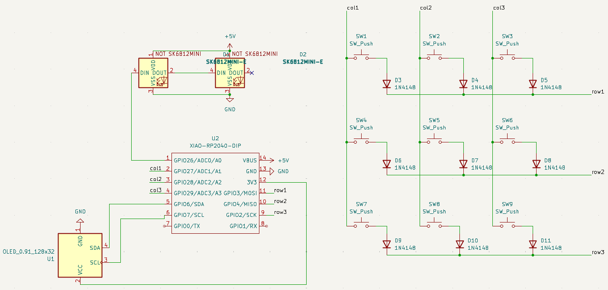
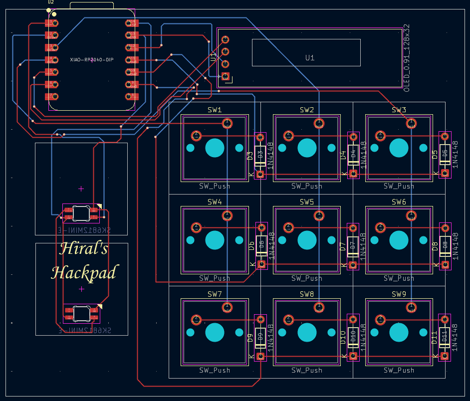
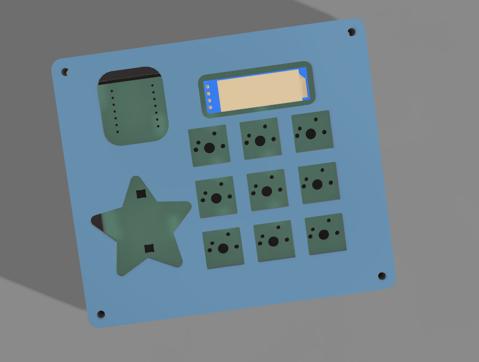

# Hiral's Hackpad

This is a nine-key macropad with an OLED and two LEDs.

## Schematic

## PCB

## Case

## BOM

I will make this using:
- 9x Cherry MX Switches
- 9x DSA Keycaps
- 9x 1N4148 DO-35 Diodes
- 2x SK6812MINI-E LEDs
- 1x 0.91" 128x32 OLED Display
- 1x XIAO RP2040
- 1x Case (2 printed parts)

| Designator | Footprint | Quantity | Value | 
| ------ | ------ |------| ------ |
| D1, D2 | MX_SK6812MINI-E_REV | 2 | SK6812MINI-E |
| D10, D11, D3, D4, D5, D6, D7, D8, D9 | D_DO-35_SOD27_P7.62mm_Horizontal | 9 | 1N4148 |
| SW1, SW2, SW3, SW4, SW5, SW6, SW7, SW8, SW9 | SW_Cherry_MX_1.00u_PCB | 9 | SW_Push |
| U1 | OLED_0.91_128x32 | 1 | OLED_0.91_128x32 |
| U2 | XIAO-RP2040-DIP | 1 | XIAO-RP2040-DIP |

## Intent

I made this to delve into the world of hardware for the first time. I've never made something like this before. I am quite excited to build it and use it.